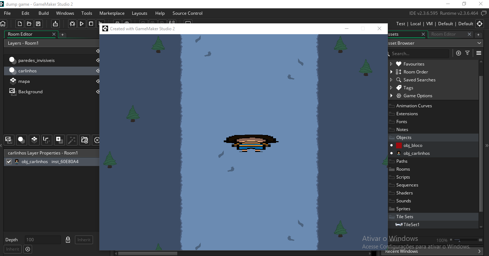

<h1>README UNDER CONSTRUCTION !!!!!!</h1>
 
<h1 align="center"></h1>
<h3 align="center"><strong>An open-source UNDERTALE fangame created in Brazil by dsans and migel8022</strong></h3>

  
  
  
  
  

> [!WARNING]
> Dumpgame's code is TERRIBLE. It's ridiculously dumb, overcomplicated and disorganized. I learned programming as I made the game and I almost always had no idea of what I was doing. No sane individual would subject themselves to the torture of forking Dumpgame.
>   <i>"the source code for undertale is literally just a bunch of rubber bands and tape stuck to a paper saying 'DETERMINATION'."</i> — Toby Fox

 
<h2>Behind the Scenes</h2>

On November 14, 2021, I opened GameMaker for the first time, created a new project with a name I made up on the spot and started the three-year long development of <b>"dump game"</b> <i>(as in "dumpster video game")</i>. I had never made a game before, had no programming knowledge whatsoever and hadn't planned literally anything.

 

 

My one and only goal was to make an UNDERTALE fangame where my friends at <b>Dumpster Friends</b>, a Discord server, were characters the player would have to fight.

Three years and a month later, in December 13, 2024, I gave up on Dumpgame. Not only had the code grown incomprehensible, but Dumpster Friends had fallen apart.

Then, on June 14, 2026, almost two years after. leaving the project unfinished. An update with almost a year worth of new content since the latest release st.

 
<h2>Never Asked Questions</h2>
<h3>Is Dumpgame still in development?</h3>
<blockquote>No, not since December 2024. More details on <a href="https://github.com/dsansthedsans/Dumpgame#behind-the-scenes"><b>"Behind the Scenes"</b></a>.</blockquote>
<h3>Is Dumpgame incomplete?</h3>
<blockquote>Yes, very. The full game would've been four times longer.</blockquote>
<h3>Is Dumpgame associated with UNDERTALE or Toby Fox?</h3>
<blockquote>No.</blockquote>
<h3>Is Dumpgame still associated with Dumpster Friends?</h3>
<blockquote>No, not anymore. Any other dump-related game like <a href="https://github.com/dsansthedsans/Yume-Danpu"><b>Yume Danpu</b></a> only pay homage to Dumpgame, not the Discord server.</blockquote>
<h3>Is Dumpgame AI-generated?</h3>
<blockquote>No, nothing related to Dumpgame is AI-generated, not even this README.</blockquote>
<h3>Is Dumpgame a virus?</h3>
<blockquote>Will you trust me if I say no? If you upload the .zip file to <a href="https://www.virustotal.com/gui/home/upload" target="_blank"><b>VirusTotal</b></a>, reliable security vendors like Google, Microsoft, Avast, Bitdefender, Malwarebytes, Kaspersky, AVG and ESET won't flag the file as malicious.</blockquote>
<h3>Why "Dumpgame"?</h3>
<blockquote>Dumpgame is named after Dumpster Friends, a Discord server. More details on <a href="https://github.com/dsansthedsans/Dumpgame#behind-the-scenes">"<b>Behind the Scenes</b>"</a>.</blockquote>
<h3>Why open-source?</h3>
<blockquote>A shark plushie asked me to. I'm not sure why, though.</blockquote>
<h3>Why Brazil?</h3>
<blockquote>I'd also like to know.</blockquote>
<h3>Why GameMaker?</h3>
<blockquote>UNDERTALE and DELTARUNE were also made on GameMaker.</blockquote>
 
<h2>Credits</h2>
<ul>
  <li>dsansthedsans<i> 〜 Programmer, Artist, Concept Artist, Animator, Writer, Designer, Localization</i></li>
  <li>migel8022<i> 〜 Composer, Sound Designer, Concept Artist for Broken Clock, Tester</i></li>
</ul>
<h4>Contributors & Testers</h4>
<ul>
  <li>Mawri<i> 〜 Concept Artist for Armsguy and Trashguy (two of the most important characters of the game)</i></li>
  <li>☭Comunista☭<i> 〜 Concept Artist for MEE6 (the most important non-player character of the game)</i></li>
  <li>fer10tanb<i> 〜 Soundtrack Assistance, Concept Art Assistance for Broken Clock</i></li>
  <li>NuggetFrango<i> 〜 Accidental Easter Egg Assistance</i></li>
  <li>Babakinha<i> 〜 Programming Assistance</i></li>
</ul>
<h4>Special Thanks</h4>
<ul>
  <li>Toby Fox</li>
  <li>Temmie Chang</li>
  <li>Tophat Interactive</li>
  <li>Arsi "Hakita" Patala</li>
  <li>Markus Persson</li>
  <li>Playdead</li>
  <li>YoYo Games</li>
  <li>Image-Line Software</li>
  <li>Peyton Burnham</li>
  <li>Anis Belkacem</li>
  <li>HybridTeacher</li>
  <li>Mãe Gamer</li>
  <li>pedrotopdosgames123</li>
</ul>
