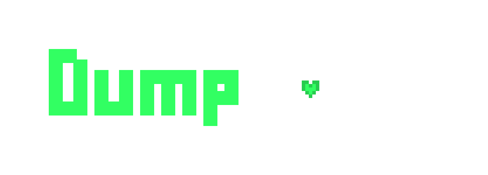
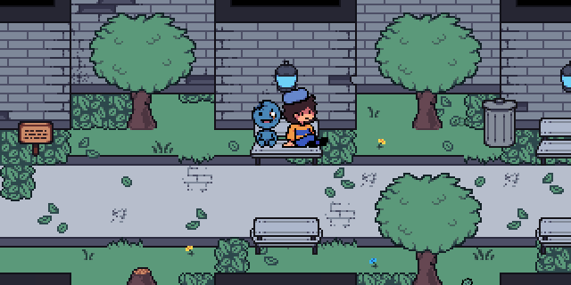
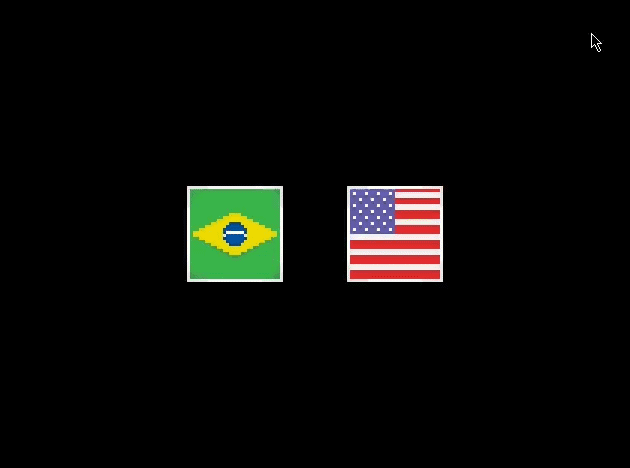
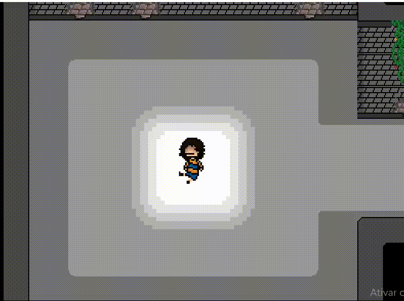
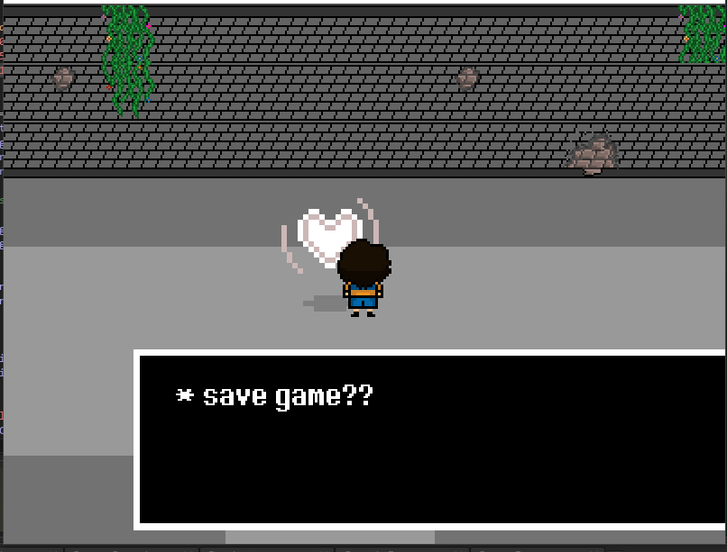
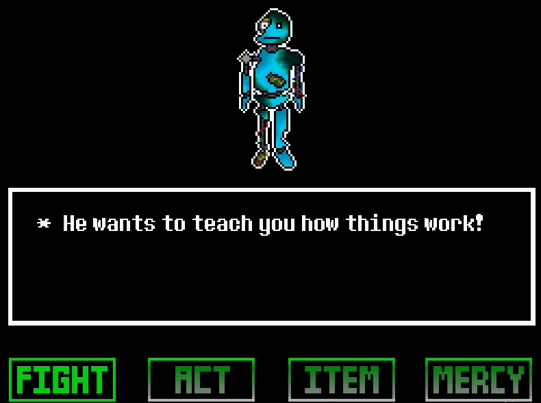
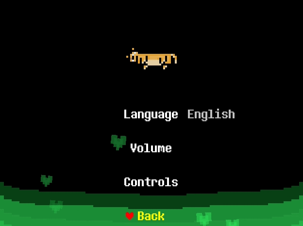
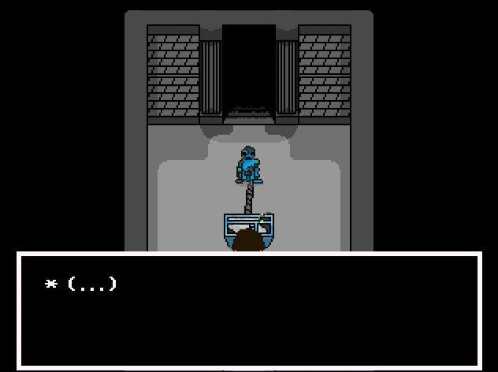
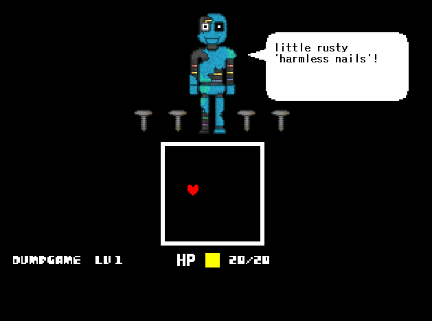

<h1>README UNDER CONSTRUCTION !!!!!! ALSO the download of 1.5.0-demo will be available SOON........................................</h1>
 
<h1 align="center"></h1>
<h3 align="center"><strong>An open-source UNDERTALE fangame created in Brazil by dsansthedsans and migel8022</strong></h3>

  
  
  
  
  

 

 

Dumpgame is a short UNDERTALE fangame about a Brazilian boy who falls into a portal to a magical world full of weird monsters and oversized children.

 

> [!WARNING]
> Dumpgame's code is TERRIBLE !!!! It's ridiculously dumb, overcomplicated and disorganized. I learned programming as I made the game and I almost always had no idea of what I was doing. No sane individual would subject themselves to the torture of forking Dumpgame.
>   <i>"the source code for undertale is literally just a bunch of rubber bands and tape stuck to a paper saying 'DETERMINATION'."</i> — Toby Fox

 
<h2>Features</h2>
<ul>
  <li>Original art, story and characters created almost entirely by one person, me, <b>dsansthedsans</b>...!</li>
  <li>An amazing soundtrack of 50+ songs fully composed and arranged by <b>migel8022</b>!</li>
  <li>harder than undertale. this is work in progrss.</li>
</ul>
 
<h2>Development History</h2>

Long ago, on November 14, 2021, I opened GameMaker for the first time, created a new project with a name I made up on the spot, then started the three-year long development of <b>"dump game"</b> <i>(as in "dumpster video game")</i>. I had never made a game before, had no programming knowledge whatsoever and hadn't planned literally anything.

I wanted to make an UNDERTALE fangame that had <b>me and my friends as either bosses or minibosses</b>, and that took place in <b>Dumpster Friends</b>, our Discord server.

 

 

Between November 2021 and February 2022, the development of Dumpgame went through what we could call its "1st generation". The game was ugly, stiff, confusing and barely functional.

 

 

The "2nd generation" of Dumpgame's development began around late February 2022 and lasted up until May that year, ...

 

 

 
UNUSED TEXT AS OF NOW:
Three years and a month later, in December 13, 2024, I gave up on Dumpgame. Not only had the code grown incomprehensible, but Dumpster Friends had fallen apart.
Then, on June 14, 2026, almost two years after.
leaving the project unfinished.
An update with almost a year worth of new content since the latest release.
It simply wasn't juicy enough.
I watched multiple GameMaker tutorials by Peyton Burnham, in particular his "How to Make an RPG" and "Branching Dialog Systems" series. Without him, Dumpgame's code would've been significantly worse.
Both of us developed our skills as we made the game.
 
<h2>Never Asked Questions</h2>
<h3>Is Dumpgame still in development?</h3>
<blockquote>No, not since December 2024. More details on <a href="https://github.com/dsansthedsans/Dumpgame#development-history"><b>"Development History"</b></a>.</blockquote>
<h3>Is Dumpgame incomplete?</h3>
<blockquote>Yes, very. The full game would've been four times longer.</blockquote>
<h3>Is Dumpgame associated with UNDERTALE or Toby Fox?</h3>
<blockquote>No.</blockquote>
<h3>Is Dumpgame still associated with Dumpster Friends?</h3>
<blockquote>No, not anymore. Any other dump-related game like <a href="https://github.com/dsansthedsans/Yume-Danpu"><b>Yume Danpu</b></a> only pay homage to Dumpgame, not the Discord server.</blockquote>
<h3>Is Dumpgame AI-generated?</h3>
<blockquote>No, nothing related to Dumpgame is AI-generated, not even this README.</blockquote>
<h3>Is Dumpgame a virus?</h3>
<blockquote>Will you trust me if I say no? If you upload the .zip file to <a href="https://www.virustotal.com/gui/home/upload" target="_blank"><b>VirusTotal</b></a>, reliable security vendors like Google, Microsoft, Avast, Bitdefender, Malwarebytes, Kaspersky, AVG and ESET won't flag the file as malicious.</blockquote>
<h3>Why "Dumpgame"?</h3>
<blockquote>Dumpgame is named after Dumpster Friends, a Discord server. More details on <a href="https://github.com/dsansthedsans/Dumpgame#development-history">"<b>Development History</b>"</a>.</blockquote>
<h3>Why open-source?</h3>
<blockquote>A shark plushie asked me to. I'm not sure why, though.</blockquote>
<h3>Why Brazil?</h3>
<blockquote>I'd also like to know.</blockquote>
<h3>Why GameMaker?</h3>
<blockquote>I searched for "make a game" on Google and clicked the first link I could find, no questions asked. (Lie)</blockquote>
 
<h2>Credits</h2>
<ul>
  <li>dsansthedsans<i> 〜 Programmer, Artist, Concept Artist, Animator, Writer, Designer, Localization</i></li>
  <li>migel8022<i> 〜 Composer, Sound Designer, Concept Artist for Broken Clock, Tester</i></li>
</ul>
<h4>Contributors & Testers</h4>
<ul>
  <li>Mawri<i> 〜 Concept Artist for Armsguy and Trashguy (two of the most important non-player characters of the game)</i></li>
  <li>☭Comunista☭<i> 〜 Concept Art Assistance for MEE6 (the most important non-player character of the game)</i></li>
  <li>fer10tanb<i> 〜 Soundtrack Assistance, Concept Art Assistance for Broken Clock</i></li>
  <li>NuggetFrango<i> 〜 Accidental Easter Egg Assistance</i></li>
  <li>Babakinha<i> 〜 Programming Assistance</i></li>
</ul>
<h4>Special Thanks</h4>
<ul>
  <li>Toby Fox</li>
  <li>Temmie Chang</li>
  <li>Tophat Interactive</li>
  <li>Arsi "Hakita" Patala</li>
  <li>Markus Persson</li>
  <li>Playdead</li>
  <li>YoYo Games</li>
  <li>Image-Line Software</li>
  <li>Peyton Burnham</li>
  <li>Anis Belkacem</li>
  <li>HybridTeacher</li>
  <li>Mãe Gamer</li>
  <li>pedrotopdosgames123</li>
</ul>
 
